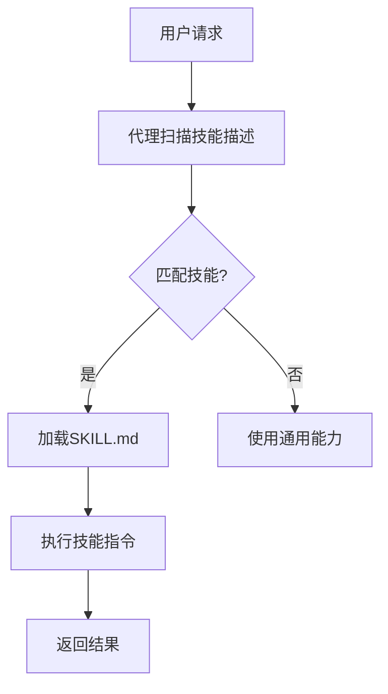

# 🤖 Agent Skills 学习笔记

> 📚 **Vibe Coding 时代的新技能** - 掌握 AI 代理技能开发

---

## 📋 目录

- [🎯 什么是 Agent Skills](#-什么是-agent-skills)
- [🏗️ 核心架构](#️-核心架构)
- [📝 SKILL.md 模板详解](#-skillmd-模板详解)
- [🚀 快速开始](#-快速开始)
- [🎨 实战案例](#-实战案例)
- [🔧 开发工具](#-开发工具)
- [📊 生态系统](#-生态系统)
- [🎯 最佳实践](#-最佳实践)

---

## 🎯 什么是 Agent Skills

### 📖 定义
  

**Agent Skills** 是 Anthropic 在 2025 年推出的开放标准，用于给 AI 代理添加新能力和专业知识。

### 🌟 核心特点
- **📦 模块化**：技能作为独立文件夹，包含指令、脚本和资源
- **🔄 按需加载**：代理根据任务动态加载相关技能
- **🌐 跨平台**：同一个技能可在多个支持的产品中使用
- **⚡ 开放标准**：由 Anthropic 开发并作为开放标准发布

### 🎪 支持的工具
| 工具名称 | 类型 | 状态 |
|---------|------|------|
|  | CLI工具 | ✅ |
|  | IDE | ✅ |
|  | 编辑器 | ✅ |
|  | AI助手 | ✅ |
|  | 代码助手 | ✅ |

---

## 🏗️ 核心架构

### 📁 技能结构
```
skill-name/
├── SKILL.md              # 🎯 主要技能文件
├── scripts/              # 📜 辅助脚本（可选）
│   ├── setup.sh
│   └── validate.py
├── references/           # 📚 参考文档（可选）
│   ├── guide.md
│   └── examples/
└── resources/            # 🎨 资源文件（可选）
    ├── templates/
    └── assets/
```

### 🔄 工作流程


---

## 📝 SKILL.md 模板详解

### 🎯 YAML 前置元数据
```yaml
---
name: skill-name                    # 🏷️ 技能标识符
description: 清晰描述技能功能        # 📝 技能描述（触发关键词）
license: Apache-2.0                 # ⚖️ 许可证
model: sonnet                       # 🤖 指定模型（可选）
allowed-tools: Read Grep Glob      # 🛠️ 允许工具（可选）
metadata:                           # 📊 自定义元数据
  category: development
  difficulty: intermediate
---
```

### 📖 内容结构
```markdown
# 技能名称

## 🎯 使用时机
- 什么情况下使用这个技能
- 触发关键词和场景

## 📋 指导步骤
1. 第一步操作
2. 第二步操作
3. ...

## 💡 示例
展示输入输出示例

## ⚠️ 指导原则
- 具体规则
- 边界情况处理
```

---

## 🚀 快速开始

### 📦 安装方式

#### 1. **使用 npx（推荐）**
```bash
npx add-skill vercel-labs/agent-skills
```

#### 2. **Claude Code 市场安装**
```bash
# 添加市场
claude plugin marketplace add getsentry/skills

# 安装插件
claude plugin install sentry-skills@sentry-skills
```

#### 3. **手动克隆**
```bash
git clone https://github.com/anthropics/skills.git
cp -r skills/skill-template ~/.claude/skills/my-skill
```

### 🛠️ 创建第一个技能

#### 1. **初始化目录**
```bash
mkdir my-awesome-skill
cd my-awesome-skill
touch SKILL.md
```

#### 2. **编写技能文件**
```yaml
---
name: my-awesome-skill
description: 帮助用户创建高质量的 Agent Skills
license: MIT
---

# My Awesome Skill

## 🎯 使用时机
当用户需要创建、优化或学习 Agent Skills 时使用。

## 📋 指导步骤
1. 分析用户需求
2. 选择合适的技能模板
3. 编写 SKILL.md 文件
4. 测试技能效果
```

---

## 🎨 实战案例

### 🚀 案例 1: React 性能优化技能
 

**来源**: `vercel-labs/agent-skills`

**特点**:
- 📊 40+ 性能规则
- 🎯 8 个优化类别
- ⚡ 按影响程度优先级排序

**使用场景**:
```bash
"优化这个 React 组件的性能"
"检查 Next.js 页面的性能问题"
```

### 🔍 案例 2: 代码审查技能
 

**来源**: `getsentry/skills`

**特点**:
- 📋 完整的审查清单
- 🎯 团队规范集成
- 🔄 PR 工作流自动化

**使用场景**:
```bash
"审查这个 PR 的代码质量"
"检查代码是否符合团队规范"
```

### 🌐 案例 3: Web 设计指南
 

**特点**:
- ♿ 100+ 可访问性规则
- 🎨 UI/UX 最佳实践
- 📱 响应式设计检查

---

## 🔧 开发工具

### 🛠️ 技能验证工具
```bash
# 官方验证工具
npx agentskills validate

# 生成提示 XML
npx agentskills generate-prompt
```

### 📝 编辑器支持
| 编辑器 | 插件 | 功能 |
|--------|------|------|
|  | Agent Skills | 语法高亮、验证 |
|  | 内置 | 原生支持 |
|  | vim-agentskills | 基础支持 |

### 🧪 测试框架
```bash
# 技能测试
npx agentskills test

# 集成测试
npx agentskills test --integration
```

---

## 📊 生态系统

### 🏆 权威仓库
| 仓库 | Stars | 描述 | 类型 |
|------|-------|------|------|
|  | 52.4k | 官方技能仓库 | 🏛️ 权威 |
|  | 16.3k | 实用技能集合 | 🚀 企业级 |
|  | 18.9k | GitHub 官方模板 | 📝 模板 |
|  | 152 | 团队实践案例 | 🎯 实战 |

### 🌐 社区资源
- 📖 **官方文档**: [agentskills.io](https://agentskills.io)
- 💬 **讨论区**: [GitHub Discussions](https://github.com/anthropics/skills/discussions)
- 🎓 **教程**: [Claude Skills Guide](https://claudecn.com)
- 🛠️ **工具**: [Agent Skills Tools](https://github.com/agentskills/tools)

---

## 🎯 最佳实践

### ✅ 设计原则
1. **🎯 单一职责**: 每个技能专注一个特定领域
2. **📝 清晰描述**: 包含足够的触发关键词
3. **🔄 渐进式披露**: 先加载元数据，再加载详细内容
4. **🛡️ 安全考虑**: 避免包含敏感信息

### 📋 命名规范
```bash
# ✅ 好的命名
react-performance-optimization
web-accessibility-audit
code-review-checklist

# ❌ 避免的命名
skill1
test-skill
my-skill
```

### 📊 性能优化
- 🎯 **元数据优化**: 保持描述在 1024 字符内
- 📦 **内容分片**: 大型技能拆分为多个文件
- ⚡ **按需加载**: 使用 `allowed-tools` 限制工具使用
- 🔄 **缓存策略**: 合理使用技能缓存

### 🧪 测试策略
```bash
# 单元测试
npx agentskills test --unit

# 集成测试
npx agentskills test --integration

# 性能测试
npx agentskills test --performance
```

---

## 🔮 未来展望

### 📈 发展趋势
- 🤖 **更多 AI 工具支持**: 扩展到更多 AI 平台
- 🌐 **标准化进程**: 推动行业标准建立
- 🎨 **可视化工具**: 图形化技能编辑器
- 🔄 **技能市场**: 技能分享和交易平台

### 🎯 学习路径
1. **🌱 初级**: 掌握基础技能创建
2. **🚀 中级**: 学习复杂技能开发
3. **🏆 高级**: 贡献开源技能生态
4. **👑 专家**: 参与标准制定

---

## 📚 参考资源

### 📖 官方文档
- [Agent Skills 规范](https://agentskills.io/specification)
- [快速开始指南](https://agentskills.io/quickstart)
- [最佳实践](https://agentskills.io/best-practices)

### 🛠️ 开发工具
- [技能验证工具](https://github.com/agentskills/validator)
- [提示生成器](https://github.com/agentskills/prompt-generator)
- [测试框架](https://github.com/agentskills/test-framework)

### 🌐 社区
- [GitHub Discussions](https://github.com/anthropics/skills/discussions)
- [Reddit r/agentskills](https://reddit.com/r/agentskills)
- [Discord 服务器](https://discord.gg/agentskills)

---

## 🎉 总结

  

Agent Skills 代表了 AI 交互的新范式，通过模块化、标准化的技能包，让 AI 代理能够更好地理解和执行特定任务。

**关键收获**:
- 🎯 **标准化**: 统一的技能格式和规范
- 🚀 **易用性**: 简单的创建和使用流程
- 🌐 **生态性**: 跨平台、跨工具的支持
- 📈 **可扩展性**: 开放的社区和贡献机制

**下一步行动**:
1. 📝 创建你的第一个技能
2. 🌟 为开源社区贡献技能
3. 🎓 深入学习高级特性
4. 🚀 探索企业级应用

---

> 💡 **提示**: 这份笔记会持续更新，建议收藏并关注最新动态！

---

**最后更新**: 2026-01-25  
**版本**: v1.0.0  
**作者**: OpenCode 学习者